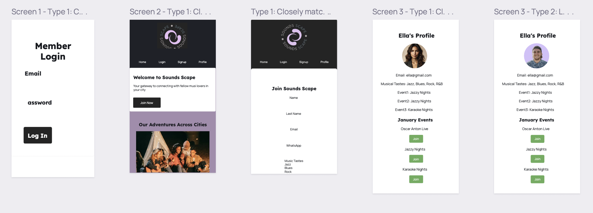

# Final-Project
# Sounds Scape Project

Welcome to Sounds Scape - your gateway to connecting with fellow music lovers in your city! 🎶

## Project Overview

### Features 🚀

- **Home Section**: The landing page welcomes users to the Sounds Scape community.

- **Membership Section**: Describes how the platform works, encouraging users to join and unlock musical experiences.

- **Testimonials Section**: Showcases what current members are saying about Sounds Scape.

- **Cities Gallery**: Displays images of events across different cities with a flip effect.

- **Signup Section**: Allows users to join Sounds Scape by providing personal information and music preferences.

- **Login Section**: Enables existing members to log in to their accounts.

- **Profile Section**: Displays user profiles with information such as name, email, musical tastes, and upcoming events.

- **Marquee Section**: Highlights the community spirit and benefits of Sounds Scape.

- **Footer**: A dotted frame with a motivational message encouraging users to share their love for music.

### How We Solved Common Problems 🤔

- **Dynamic Content Loading**: Utilized JavaScript to dynamically load testimonials, gallery images, and the marquee, ensuring a dynamic and engaging user experience.

- **Navigation System**: Implemented a navigation system to switch between different sections seamlessly.

- **Styling and Layout**: Employed CSS for styling, ensuring a visually appealing and responsive design across various devices.

- **Popup Functionality**: Created popups for the login form and terms and conditions, enhancing user interaction.

- **Event Joining Feature**: Implemented a button to join events, enhancing the user's engagement with the platform.

- **Profile Display**: Dynamically displayed user profiles with personalized information and upcoming events.

### Project Structure 🏗️

- **HTML**: Contains the structure of the website, including sections, navigation, and placeholders for dynamic content.

- **CSS (styles.css)**: Defines the styling and layout of the website, with color variables for easy customization.

- **JavaScript (app.js)**: Manages dynamic content loading, navigation, popups, and user profile functionality.

### Preview

### Website Link

[Visit Sounds Scape](link)

theme: jekyll-theme-THEME-NAME

